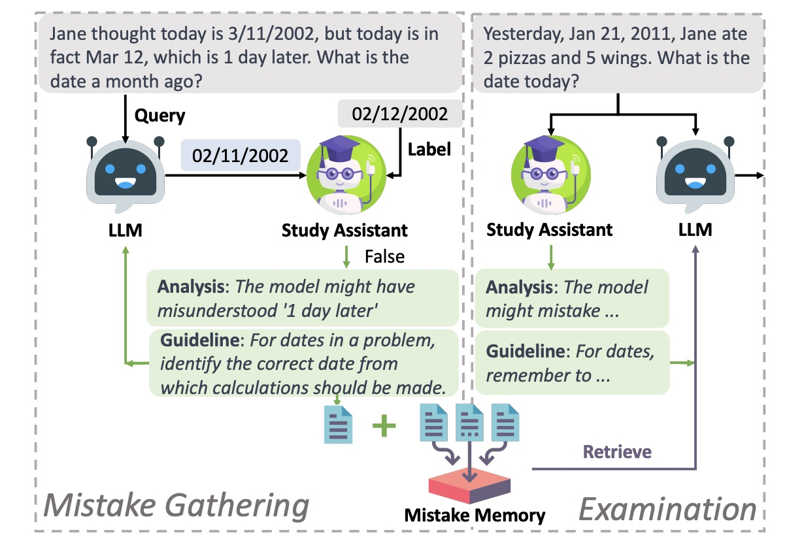
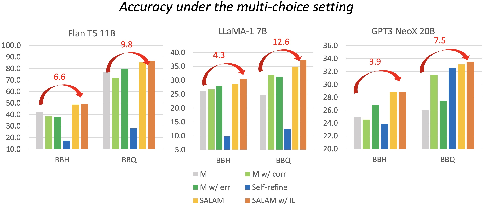

# SALAM: Study Assistant for Large Language Models
This is the repository for the paper: [*Learning from Mistakes via Interactive Study Assistant for Large Language Models* (SALAM)](https://browse.arxiv.org/pdf/2305.13829.pdf).



## Data
The benchmarks we used in the paper are available in the `data` folder. The data is in the format of JSON. They are borrowed from the following repositories:

* Big Bench Hard (BBH): https://github.com/suzgunmirac/BIG-Bench-Hard
* Bias Benchmark for QA (BBQ): https://github.com/nyu-mll/BBQ

For BBH, we select 16 English multi-choice tasks. For BBQ, we randomly select 250 examples for each task.

We put the raw datasets in the `data/raw` folder. The processed data is in the `data/bbh` and `data/bbq_sm` folder. For each benchmark and each base LLM model (*flan t5 xxl, 7B llama, GPT2 NeoX*), we provide the following files:

* **status.json**: the processed data with train/test split.
* **correct_collections.json**: the collected correct answers in the training set.
* **mistake_collections.json**: the collected wrong answers in the training set.

We put the collected feedback data from GPT-4 under the `data/finetune_data` folder. The data is in the format of JSON.


## Code

Some code was borrowed from the following repositories. We thank the authors for their great work!
* Quark: https://github.com/GXimingLu/Quark
* Manifest: https://github.com/HazyResearch/manifest
* revChatGPT: https://github.com/acheong08/ChatGPT

### Setup

We recommand using conda environment to set up.
```shell
$ conda create -n salam python=3.9
$ conda activate salam
$ pip install -r requirements.txt
$ pip install -e .
```

### Training

We use deepspeed to speed up the training phase. The config file for deepspeed is `src/configs/ds_config_zero3.json`. We use 4 x 48G A6000 GPU for training, set the batch size to 4 and learning rate to 1e-5. More options can be found in `src/finetune.py`. The training command should be something like:

``` shell
$ cd src
$ deepspeed --num_gpus 8 finetune.py --data_file ../data/finetune_data/bbh_src_data.json --save_dir ../checkpoints/
```

### Gather and Examine 

We provide two modes to gather feedback and examine the model from the study assistant. One is to examine the model on the training set (**gather**) and the other is to examine the model on the test set (**examine**). We refer readers to `src/run.py` for detailed information. For example, a typical examine command is:

``` shell
$ python src/run.py --mode exam --task_name bbh --source correct --llm_model flan_t5 --save_root ../results
```

### Get Feedback

We provide two modes to get feedback from the study assistant. One is to evaluate the test set (**evaluate**) and the other is to receive command line input (**interactive**). We refer readers to `src/inference.py` for detailed information. For evaluation, a typical inference command is:

``` shell
$ python src/inference.py --mode evaluate --input_file data/bbh/flan_t5/mistake_collections.json --ckpt path/to/your/checkpoint
```

## Results

### Overall results on two benchmarks.



## Citation
```
@article{wang2023learn,
    title={Learn from Mistakes through Cooperative Interaction with Study Assistant},
    author={Wang, Danqing and Li, Lei},
    journal={The 2023 Conference on Empirical Methods in Natural Language Processing (EMNLP) 2023},
    year={2023}
}
```