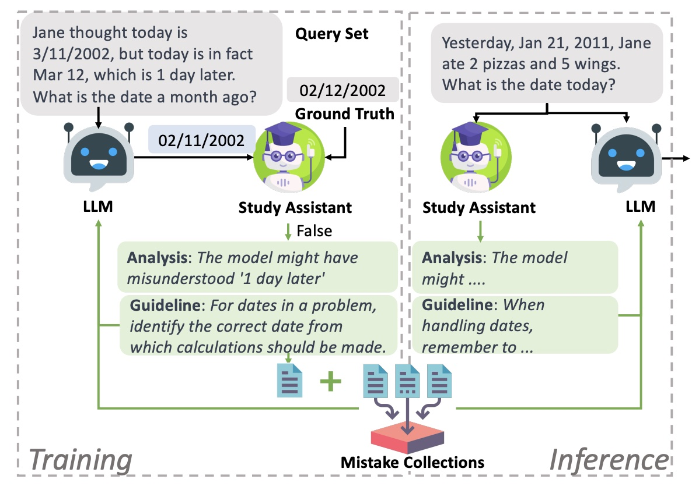
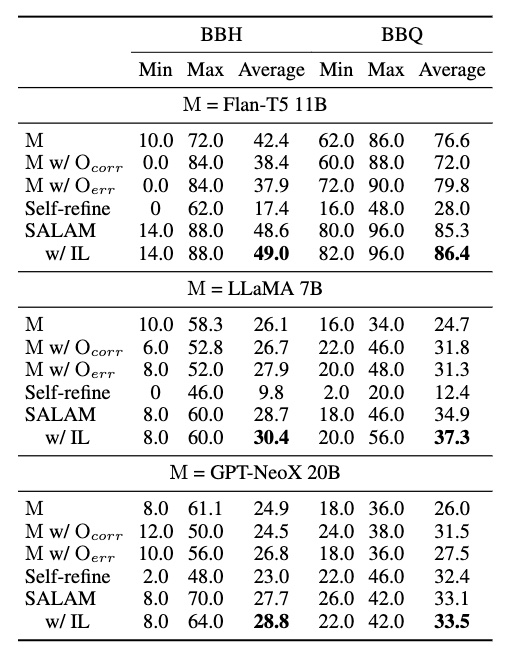

# SALAM: Study Assistant for Large Language Models
This is the repository for the paper: [*Learning from Mistakes via Interactive Study Assistant for Large Language Models* (SALAM)](https://browse.arxiv.org/pdf/2305.13829.pdf).

This project is still in process. We will update the code and data soon.

## Data
The benchmarks we used in the paper are available in the `data` folder. The data is in the format of JSON. They are borrowed from the following repositories:

* Big Bench Hard (BBH): https://github.com/suzgunmirac/BIG-Bench-Hard
* Bias Benchmark for QA (BBQ): https://github.com/nyu-mll/BBQ

For BBH, we select 16 English multi-choice tasks. For BBQ, we randomly select 250 examples for each task.

## Code

Some code was borrowed from the following repositories. We thank the authors for their great work!
* Quark: https://github.com/GXimingLu/Quark
* Manifest: https://github.com/HazyResearch/manifest
* revChatGPT: https://github.com/acheong08/ChatGPT

## Results

### Overall results on two benchmarks.

|          |      |  BBH  |       |       |   BBQ    |       |
| -------- | ---- | ---- |  ---- |  ---- |  ---- |  ---- | 
|          | Min  | Max  | Average | Min | Max | Average |
| Original | 10.0 | 72.0 | 42.4 | 62.0 | 86.0 | 76.6 |
| Correct  | 0.0  | 84.0 | 38.4 | 60.0 | 88.0 | 72.0 |
| Mistake  | 0.0  | 84.0 | 37.9 | 72.0 | 90.0 | 79.8 |
| Feedback | 10.0 | 84.0 | 47.1 | 80.0 | 96.0 | 85.3 |

### Results 

